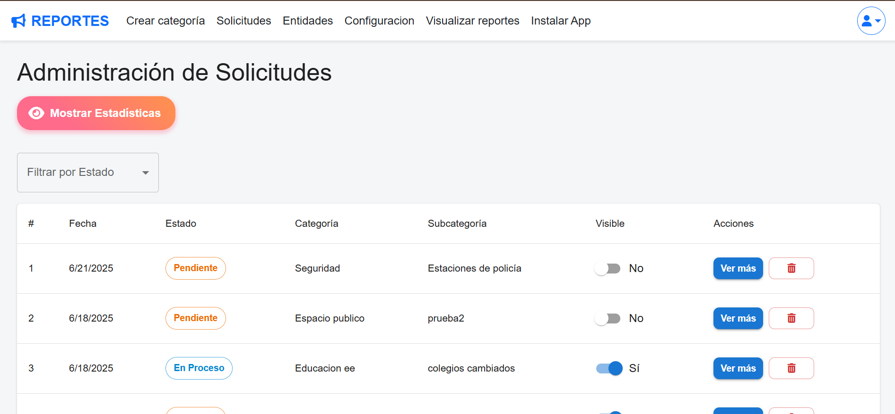
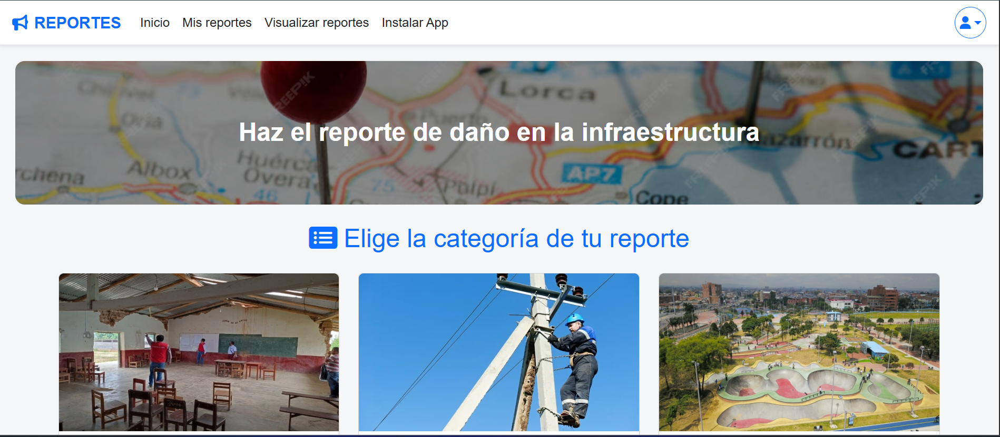
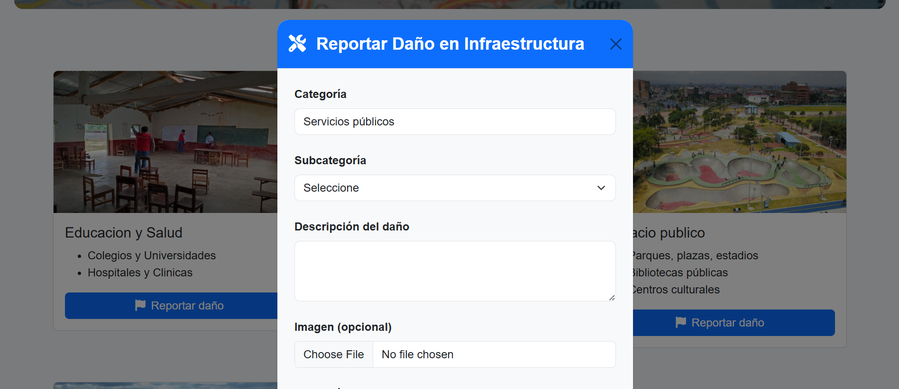
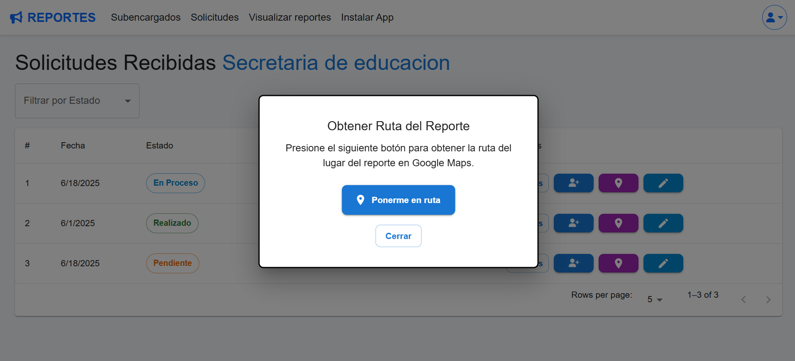

# 📊 Sistema de Reportes de Daños a Infraestructura Pública

Este proyecto es una **plataforma web desarrollada con React y Firebase** que permite a los ciudadanos **reportar daños en infraestructura pública**, realizar seguimiento a sus reportes y facilitar la gestión por parte de entidades y administradores.

La aplicación está pensada para ser **responsive**, accesible desde dispositivos móviles y de escritorio, y cuenta con un **panel de estadísticas** que permite visualizar el estado y distribución de los reportes de forma clara y visual.

---

## 🧠 Objetivo del Proyecto

- Facilitar el reporte de daños en infraestructura pública
- Centralizar la información para entidades responsables
- Permitir seguimiento del estado de cada reporte
- Visualizar métricas y estadísticas en tiempo real
- Garantizar una buena experiencia de usuario en móvil y desktop

---

## 🚀 Tecnologías y Herramientas Utilizadas

### Frontend
- **React.js**
- **Material UI (MUI)** – diseño de componentes
- **React-Bootstrap** (en otras vistas del proyecto)
- **Recharts** – gráficos y estadísticas
- **Font Awesome** – iconografía
- **Responsive Design** (Mobile First)

### Backend / Servicios
- **Firebase**
  - Authentication (Email/Password y Google)
  - Firestore (Base de datos)
  - Storage (Imágenes de reportes)
  - Cloud Functions
- **Nodemailer** (envío de correos automáticos)

### Otros
- Control de roles (`admin`, `user`, `entidad`)
- Estados globales para optimización de consultas
- Buenas prácticas de arquitectura y componentes reutilizables

---

## 👥 Roles del Sistema

- **Usuario**
  - Crear reportes
  - Ver sus propios reportes
  - Eliminar reportes con confirmación
- **Entidad**
  - Recibir reportes asignados
  - Gestionar estados
- **Administrador**
  - Crear usuarios tipo entidad
  - Visualizar todos los reportes
  - Acceder al panel de estadísticas

---


## 📸 Capturas del Proyecto

> 🖼️ Todas las imágenes utilizadas en este README se encuentran organizadas dentro de la carpeta  
> `screenshots/`, donde se documenta el **resultado final** de la aplicación, Algunas vistas.

---
## 🖼️ Algunas vistas de la aplicación

A continuación se muestran algunas pantallas representativas de la aplicación, que permiten visualizar el flujo y las principales funcionalidades del sistema.

---

### 📊 Panel Administrador

Vista principal del panel de administración, desde donde se gestionan los reportes, usuarios y funcionalidades clave de la plataforma.



---

### 🗂️ Categorías del Reporte

Pantalla donde se visualizan y seleccionan las distintas categorías disponibles para la creación y clasificación de reportes.



---

### 📝 Creación de Reporte

Interfaz destinada a la creación de nuevos reportes, guiando al usuario durante el proceso de registro de la información.



---

### ⏱️ Ruta al Reporte en Tiempo Real

Vista que muestra el seguimiento o acceso al reporte en tiempo real, permitiendo una visualización dinámica del estado y progreso.



---


## 📂 Estructura de Carpetas

```bash
src/
│
├── components/
│   ├── ReporteEstadisticas.jsx
│   ├── ReportModal.jsx
│   ├── Navbar.jsx
│   └── ...
│
├── pages/
│   ├── ReportPage.jsx
│   ├── MisReportes.jsx
│   ├── AdminSolicitudes.jsx
│   └── ...
│
├── context/
│   ├── AuthContext.jsx
│   ├── ReportesContext.jsx
│
├── services/
│   ├── firebase.js
│   ├── reportesService.js
│
├── assets/
│   ├── images/
│   └── icons/
│
└── App.jsx

~~~


